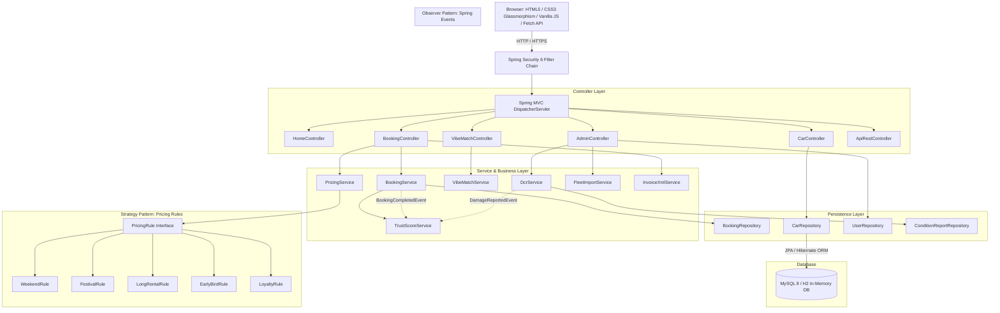
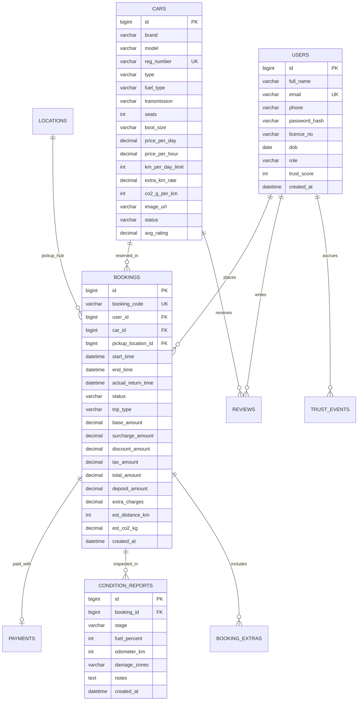

# ⚡ DriveSense: Smart Car Rental Platform
> **Advanced Java Project-Based Learning (PBL) System**  
> *Production-grade full-stack vehicle rental engine demonstrating Spring Boot 3, JPA/Hibernate, Spring Security 6, Thymeleaf, XML/JAXB, Strategy & Builder design patterns, and multithreaded concurrency locking.*

---

## 🌟 Executive Summary & Problem Statement

Traditional car rental platforms and local operators suffer from systemic operational inefficiencies:
1. **Accidental Double Bookings:** High race conditions during peak travel windows.
2. **Return & Damage Disputes:** Verbal, unrecorded pickup inspections resulting in customer-vendor friction.
3. **Opaque Hand-Calculated Pricing:** Arbitrary surcharges that destroy customer trust.
4. **Catalogue Fatigue:** Generic unfiltered grids that force users to guess which car fits their travel context.

**DriveSense** solves these core issues through an intelligent platform featuring trip-intent vehicle recommendations (**Vibe Match**), an XML-driven dynamic rule-based pricing engine, interactive SVG digital condition reports (**DCR**), automated customer **Trust Scores** with loyalty tiers, tailpipe carbon footprint estimation, and Pessimistic DB Row Locking to completely eliminate double bookings.

---

## 🚀 Key USPs (Unique Selling Propositions)

### 1. 🎯 USP 1: Vibe Match Recommender ("Pick your trip, not your car")
Instead of forcing users through dozens of car specifications, the multi-step Vibe Match wizard matches the vehicle to the trip intent using a weighted vector scoring algorithm implemented via **Java 17 Streams**:
$$\text{Score} = 0.35 \times \text{seatFit} + 0.20 \times \text{luggageFit} + 0.20 \times \text{budgetFit} + 0.15 \times \text{tripTypeFit} + 0.10 \times \text{ratingScore}$$
- Evaluates real-time availability across requested calendar dates.
- Returns top-ranked vehicles with a match percentage ring and human-readable justification (e.g., *"Perfect 7-seater with large boot for family road trip"*).

### 2. 💰 USP 2: Transparent Dynamic Pricing Engine
Demonstrating the **Strategy Pattern** and **Builder Pattern**:
- Pricing is calculated dynamically from XML rules (`pricing-rules.xml`) unmarshalled at startup using **JAXB**:
  - **Weekend Uplift:** +10% on Saturday/Sunday bookings.
  - **Festival Season Surcharge:** +15% during configured peak holiday dates.
  - **Long Rental Discount:** -5% for 3–6 days, -12% for 7+ days.
  - **Early Bird Discount:** -7% for bookings made 14+ days in advance.
  - **Loyalty Tier Discount:** Silver (0%), Gold (-3%), Platinum (-6%).
  - **Deposit Waiver:** Gold (50% waiver), Platinum (100% zero deposit).
  - **GST Breakdown:** Transparent 18% tax calculation.
- Live AJAX updates at `/api/price/preview` provide real-time cost breakdown without page reloads.

### 3. 🔍 USP 3: Digital Condition Report (DCR)
Eliminates car return disputes through an interactive 6-zone vehicle body inspection:
- Top-view vehicle diagram with clickable zones: `FRONT`, `REAR`, `LEFT`, `RIGHT`, `ROOF`, `INTERIOR`.
- Tracks initial fuel %, odometer reading, and pre-existing blemishes at pickup.
- Side-by-side comparison on return: auto-flags newly damaged zones (charging ₹2,500/zone), fuel deficit penalties (₹110/L), and excess kilometer surcharges.
- Automatically adjusts customer final bill and updates account trust status.

### 4. 🛡️ USP 4: Customer Trust Score & Loyalty Tiers
Customer reliability is tracked through a bounded Trust Score (0 to 100, default 50):
- **Events & Scoring:**
  - On-time return with zero new damage: `+5 pts`
  - 5-star verified review: `+1 pt`
  - Late vehicle return: `-5 pts`
  - Cancellation within 24h of pickup: `-3 pts`
  - New damage detected in Return DCR: `-10 pts`
- **Tiers:**
  - **Silver (0–59):** Standard pricing, full refundable deposit.
  - **Gold (60–84):** 3% discount, 50% security deposit waiver.
  - **Platinum (85–100):** 6% discount, **100% zero security deposit**.
- Implemented via Spring `ApplicationEventPublisher` and `@EventListener` (`BookingCompletedEvent`, `DamageReportedEvent`, `LateReturnEvent`) for decoupled, clean architecture.

### 5. 🌱 USP 5: Trip Carbon Estimator
Calculates estimated tailpipe $\text{CO}_2$ emissions based on planned kilometers and powertrain factors:
- Electric Vehicles (EV): **0 g/km** (Clean mobility badge + neon glow highlight).
- Hybrid / CNG: **90–105 g/km**.
- Petrol / Diesel: **125–192 g/km**.
- Displays comparative environmental impact badges across catalogue cards and rental summaries.

### 6. 📄 USP 6: XML Ecosystem & Enterprise Integration
Provides real-world enterprise XML handling:
- **XML Invoices (`invoice.xml`):** JAXB marshaling validated against strict XML Schema Definition (`invoice.xsd`).
- **Fleet Bulk Import (`fleet.xml`):** JAXB XML parser with XSD validation (`fleet.xsd`) providing per-record error validation reports in the Admin portal.
- **Dynamic Pricing Rules:** Admin-editable `pricing-rules.xml` parsed at runtime.

---

## 🔒 Concurrency & Double-Booking Prevention

To eliminate race conditions when two customers attempt to book the same vehicle for overlapping dates simultaneously, DriveSense implements **Pessimistic Row Locking**:

```java
// CarRepository.java
@Lock(LockModeType.PESSIMISTIC_WRITE)
@Query("SELECT c FROM Car c WHERE c.id = :id")
Optional<Car> findByIdWithLock(@Param("id") Long id);
```

```java
// BookingService.java
@Transactional
public Booking createBooking(BookingRequest request, String customerEmail) {
    // 1. Acquire exclusive write lock on Car entity row
    Car car = carRepository.findByIdWithLock(request.getCarId())
            .orElseThrow(() -> new ResourceNotFoundException("Car not found"));

    // 2. Perform atomic overlapping availability check
    long overlaps = bookingRepository.countOverlaps(
            car.getId(), 
            request.getStartTime(), 
            request.getEndTime()
    );
    if (overlaps > 0) {
        throw new CarNotAvailableException("Vehicle is already reserved for the selected period.");
    }
    ...
}
```

### Verified by Multithreaded Integration Test
DriveSense includes `BookingConcurrencyTest.java` utilizing `ExecutorService` and `CountDownLatch` where two parallel threads attempt booking the identical vehicle at the same millisecond:
- **Result:** Exactly 1 booking succeeds (HTTP 200/Saved), and the second is safely rejected (`CarNotAvailableException`), maintaining 100% transactional integrity.

---

## 🏛️ System Architecture & Design Patterns

### Layered Architecture Diagram



### Design Pattern Catalog (Viva Ready)

| Pattern | Component / Location | Purpose |
| :--- | :--- | :--- |
| **MVC** | Controllers, Thymeleaf Templates, Domain Entities | Clean separation of UI, presentation, and data persistence. |
| **Strategy** | `PricingRule`, `WeekendRule`, `FestivalRule`, `LongRentalRule` | Encapsulates pricing calculation algorithms into swappable strategies. |
| **Builder** | `PriceBreakdownBuilder`, `PriceBreakdown` | Fluent, readable construction of complex multi-part price breakdowns. |
| **Factory** | `PricingRuleLoader` | Instantiates pricing rule strategy instances dynamically from XML configuration. |
| **Observer** | Spring `ApplicationEventPublisher`, `@EventListener` | Decoupled event handling for trust score adjustments on completion/damage. |
| **DTO** | `BookingRequest`, `PriceBreakdown`, `VibeRequest`, `CarCard` | Isolates web layer parameters from core JPA database entities. |
| **Singleton** | All Spring `@Service`, `@Repository`, and `@Component` beans | Managed thread-safe bean lifecycle by Spring IoC container. |

---

## 🗄️ Database Design & Entity Relationship



---

## ⚡ Quickstart & Setup Guide

### System Requirements
- **Java:** JDK 17 or higher (tested on Java 17 and Java 25)
- **Maven:** 3.8+ (convenient `mvn.cmd` / `mvnw.cmd` wrapper pre-installed in workspace)
- **Browser:** Google Chrome, Firefox, or Microsoft Edge

### 🚀 Deployment Options (See [DEPLOYMENT_GUIDE.md](file:///c:/Users/hp/Desktop/Vehical%20Rental%20System/DEPLOYMENT_GUIDE.md))
- **1-Command Docker Compose (App + MySQL Database):**  
  `docker compose up --build -d` (spins up MySQL 8 + Spring Boot with volume persistence)
- **Local Dev / Evaluation (Zero-Setup Embedded Mode):**  
  `.\mvn.cmd spring-boot:run` (or `./mvnw spring-boot:run`)
- **Cloud Deployment:** Complete step-by-step instructions for **Railway**, **Render**, and **AWS/Linux VPS** are documented in [DEPLOYMENT_GUIDE.md](file:///c:/Users/hp/Desktop/Vehical%20Rental%20System/DEPLOYMENT_GUIDE.md).

Once started, open your browser and navigate to:
👉 **`http://localhost:8080/`**

### Pre-configured Demo Accounts

| Role | Email Address | Password | Permissions & Initial State |
| :--- | :--- | :--- | :--- |
| **Fleet Admin** | `admin@drivesense.com` | `admin123` | Full access to `/admin/**`, fleet CRUD, DCR inspections, revenue analytics, XML import. |
| **Gold Customer** | `user@example.com` | `user123` | Trust Score 78 (Gold Tier, 3% discount, 50% deposit waiver), past completed booking `DS-2026-000123`. |
| **Platinum VIP** | `vip@example.com` | `vip123` | Trust Score 92 (Platinum Tier, 6% discount, **100% zero deposit**). |

---

## 🧪 Automated Test Suite

Run all unit, integration, XML validation, and concurrency tests via Maven:

```bash
.\mvn.cmd test
```

### Key Test Classes Included:
- **`BookingConcurrencyTest.java`**: Simulates 2 simultaneous threads reserving the same car; verifies Pessimistic locking.
- **`PricingServiceTest.java`**: Validates Base, Weekend (+10%), Festival (+15%), Long Rental (-5%/-12%), Early Bird (-7%), GST (18%), and Deposit calculation.
- **`VibeMatchServiceTest.java`**: Evaluates stream-based 5-attribute weighted scoring algorithm.
- **`TrustScoreServiceTest.java`**: Tests event-driven score adjustments clamped between 0 and 100.
- **`InvoiceXmlServiceTest.java`**: Marshals XML invoices and strictly validates them against `invoice.xsd`.

---

## 🎬 5-Minute Evaluator / College Demo Script

| Time | Phase | Action / Screen | Key Talking Points |
| :--- | :--- | :--- | :--- |
| **0:00 – 0:30** | **Home Page** | Open `http://localhost:8080/` | Showcase Dark Glassmorphism design tokens (`#0B1020`/`#121A33`), CSS gradients, animated stats, floating search bar. |
| **0:30 – 1:15** | **Vibe Match** | Click *"Pick Your Trip"* / navigate to `/vibe-match`. Select: Family Trip, 6 Passengers, Large Luggage, ₹5,000 budget. | Explain weighted vector algorithm using **Java Streams**; demonstrate top 3 ranked cars with match % ring and reason strings. |
| **1:15 – 2:00** | **Live Pricing** | Select vehicle, open `/book/1`. Toggle insurance, driver add-on, adjust dates. | Demonstrate AJAX `/api/price/preview` calling Strategy Pattern rules configured in `pricing-rules.xml` (Weekend, Long-term, Loyalty tier discounts). |
| **2:00 – 2:45** | **Booking & XML** | Complete booking form using simulated Card/UPI. Navigate to `/my-bookings`. | View booking details, open printable HTML invoice, click **"Download XML Invoice"** (validated against `invoice.xsd`). |
| **2:45 – 4:00** | **Admin & DCR** | Log in as `admin@drivesense.com` / `admin123`. Open `/admin`. | 1. View live Chart.js revenue & category doughnut.<br>2. Open Booking `DS-2026-000123`.<br>3. Demonstrate Digital Condition Report (DCR) with interactive clickable car outline.<br>4. Mark new bumper damage & complete trip; show auto-computed damage fee and Trust Score reduction. |
| **4:00 – 5:00** | **XML Bulk Import** | Navigate to `/admin/fleet/import-xml`. Upload `sample-fleet.xml`. | Highlight XSD schema validation, DOM/JAXB parsing, and atomic vehicle fleet onboarding. |

---

## 🎓 Advanced Java Viva Q&A Cheat Sheet

1. **Q: How did you prevent double-booking when multiple users book the same car?**  
   *A:* In `BookingService.java`, booking creation is annotated with `@Transactional`. We use JPA's `@Lock(LockModeType.PESSIMISTIC_WRITE)` on `carRepository.findByIdWithLock(carId)` to acquire a database-level row lock before running `bookingRepository.countOverlaps(...)`. Any concurrent transaction waits until the lock releases, preventing dirty reads or overlapping inserts.

2. **Q: How does the pricing rules engine demonstrate the Strategy Pattern?**  
   *A:* We defined a `PricingRule` interface with an `apply(PricingContext ctx, PriceBreakdownBuilder builder)` method. Concrete classes (`WeekendRule`, `FestivalRule`, `LongRentalRule`, `LoyaltyRule`) implement individual logic. The rules are loaded dynamically from `pricing-rules.xml` at startup via JAXB, allowing non-developers to edit business rules without code changes.

3. **Q: How does the Trust Score system stay decoupled from booking code?**  
   *A:* We used the **Observer Pattern** via Spring's `ApplicationEventPublisher`. When a trip finishes or damage is found, events like `DamageReportedEvent` are fired. The `TrustScoreService` listens via `@EventListener` and adjusts the score asynchronously without polluting core booking logic.

4. **Q: How is XML used practically beyond `pom.xml`?**  
   *A:* XML is used in three enterprise scenarios:
   1. Unmarshalling dynamic pricing rules (`pricing-rules.xml`) via JAXB.
   2. Generating standardized electronic tax invoices (`invoice.xml`) validated against `invoice.xsd`.
   3. Bulk-importing vehicle fleets from XML files with per-record schema validation in the admin dashboard.

---

## 📁 Project Structure

```
Vehical Rental System/
├── pom.xml                               # Maven project definition (Spring Boot 3.3.4, Security, JPA, Thymeleaf, JAXB)
├── mvn.cmd / mvnw.cmd                    # Maven wrappers
├── src/
│   ├── main/
│   │   ├── java/com/drivesense/
│   │   │   ├── DriveSenseApplication.java
│   │   │   ├── config/                   # SecurityConfig, DataInitializer, XmlConfig
│   │   │   ├── controller/               # HomeController, CarController, BookingController, AdminController, ApiRestController...
│   │   │   ├── dto/                      # BookingRequest, PriceBreakdown, VibeRequest, CarCard...
│   │   │   ├── entity/                   # User, Car, Location, Booking, ConditionReport, Review, TrustEvent...
│   │   │   ├── enums/                    # CarType, FuelType, BookingStatus, TripType, TrustTier, DamageZone...
│   │   │   ├── event/                    # BookingCompletedEvent, DamageReportedEvent...
│   │   │   ├── exception/                # CarNotAvailableException, GlobalExceptionHandler...
│   │   │   ├── pricing/                  # PricingRule (Strategy), WeekendRule, LongRentalRule, PriceBreakdownBuilder...
│   │   │   ├── repository/               # CarRepository (Pessimistic Lock), BookingRepository, UserRepository...
│   │   │   ├── service/                  # BookingService, PricingService, VibeMatchService, DcrService, InvoiceXmlService...
│   │   │   └── util/                     # CarbonCalculator, DateUtil
│   │   └── resources/
│   │       ├── application.properties    # H2 in-memory default profile / MySQL switch
│   │       ├── data.sql                  # Standalone SQL demo seed data
│   │       ├── schema.sql                # Complete relational DDL schema
│   │       ├── static/                   # Glassmorphic CSS (style.css), JS (main.js, booking.js, dcr.js, admin-charts.js)
│   │       ├── templates/                # Thymeleaf templates (index, catalogue, booking, vibe-match, admin/*, invoice)
│   │       └── xml/                      # pricing-rules.xml, invoice.xsd, fleet.xsd, sample-fleet.xml
│   └── test/java/com/drivesense/         # Unit, Concurrency, and XML validation tests
└── README.md
```

---
*Built with ❤️ for the Advanced Java Project-Based Learning (PBL) Curriculum.*
